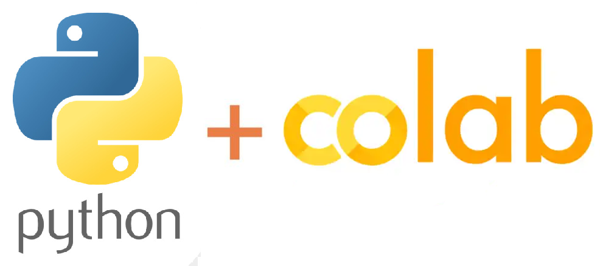

 

# Análise de Dados com Linguagem SQL e PySpark no Google Colab

O objetivo deste projeto é mostrar passo a passo como instalar o Apache Spark no Google Colab e então usar o PySpark e a Linguagem SQL para um extenso e completo trabalho de análise de dados.

  

